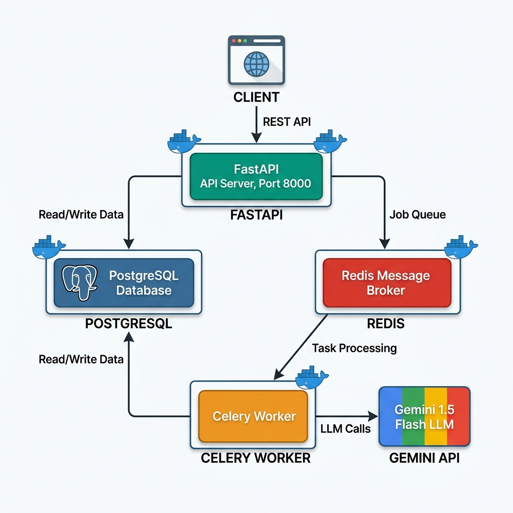

# AI-Powered Transaction Processing Pipeline

A production-grade, end-to-end pipeline that ingests CSV transaction data, cleans and validates it, detects anomalies using statistical rules, enriches transactions with LLM-powered categorisation (Google Gemini 1.5 Flash), and produces structured summaries — all exposed through a RESTful API with asynchronous background processing.

---

## Architecture



### Data Flow

```
CSV Upload ──► FastAPI ──► Save to Disk + Create Job ──► Celery Worker
                                                             │
                                    ┌────────────────────────┘
                                    ▼
                              CSV Cleaning
                           (pandas pipeline)
                                    │
                                    ▼
                          Anomaly Detection
                       (statistical + rule-based)
                                    │
                                    ▼
                          LLM Categorisation
                          (Google Gemini API)
                                    │
                                    ▼
                         Store in PostgreSQL
                        (transactions table)
                                    │
                                    ▼
                        Generate Job Summary
                      (spend, merchants, risk)
                                    │
                                    ▼
                          Mark Job Complete
```

1. **Upload**: User uploads a CSV file via `POST /jobs/upload`.
2. **Queue**: The API saves the file, creates a `Job` record, and dispatches a Celery task.
3. **Clean**: The worker reads the CSV, normalises dates/currencies, removes duplicates, fills missing fields.
4. **Detect Anomalies**: Statistical outliers (3× median per account) and rule-based checks (domestic merchant + foreign currency) flag suspicious rows.
5. **LLM Enrich**: Google Gemini 1.5 Flash categorises uncategorised transactions in batch.
6. **Persist**: Cleaned, enriched rows are bulk-inserted into the `transactions` table.
7. **Summarise**: Aggregate statistics (total spend by currency, top merchants, anomaly count, risk level) and an LLM-generated narrative are stored in `job_summaries`.
8. **Complete**: The job status is updated to `completed` (or `failed` on error).

---

## Tech Stack

| Layer              | Technology           | Purpose                              |
| ------------------ | -------------------- | ------------------------------------ |
| **API Framework**  | FastAPI 0.115        | REST endpoints, request validation   |
| **Task Queue**     | Celery 5.4 + Redis 7 | Async background processing          |
| **Database**       | PostgreSQL 15        | Persistent storage                   |
| **ORM**            | SQLAlchemy 2.0       | Database models and queries          |
| **Migrations**     | Alembic 1.13         | Schema versioning                    |
| **Data Processing**| pandas 2.2           | CSV cleaning and transformation      |
| **LLM**           | Google Gemini 1.5 Flash | Transaction categorisation & narrative |
| **Validation**     | Pydantic v2          | Request/response schemas             |
| **Containerisation** | Docker + Compose   | Reproducible deployment              |
| **Testing**        | pytest 8.3           | Unit and integration tests           |

---

## Setup & Installation

### Prerequisites

- **Docker** and **Docker Compose** (v2+)
- **Gemini API key** (optional — LLM features degrade gracefully without it)

### Quick Start

```bash
# 1. Clone the repository
git clone <repo-url>
cd <project-directory>

# 2. Configure environment
cp .env.example .env
# Edit .env and add your GEMINI_API_KEY

# 3. Start all services (Postgres, Redis, API, Worker)
docker compose up --build

# The API will be available at http://localhost:8000
# Interactive docs at http://localhost:8000/docs
```

### Running Tests

```bash
# Inside the container
docker compose exec api pytest tests/ -v

# Or locally (with a virtual environment)
pip install -r requirements.txt
pytest tests/ -v
```

---

## Environment Variables

| Variable        | Default                                          | Description                        |
| --------------- | ------------------------------------------------ | ---------------------------------- |
| `GEMINI_API_KEY`| *(empty)*                                        | Google Gemini API key for LLM features |
| `DATABASE_URL`  | `postgresql://postgres:postgres@db:5432/pipeline_db` | PostgreSQL connection string       |
| `REDIS_URL`     | `redis://redis:6379/0`                           | Redis broker URL for Celery        |
| `UPLOAD_DIR`    | `/app/uploads`                                   | Directory for uploaded CSV files   |

---

## API Endpoints

| Method | Path                        | Description                                         |
| ------ | --------------------------- | --------------------------------------------------- |
| GET    | `/health`                   | Health check                                        |
| POST   | `/jobs/upload`              | Upload a CSV file and start processing              |
| GET    | `/jobs/`                    | List all jobs (optional `?status=pending`)      |
| GET    | `/jobs/{job_id}/status`     | Get job status and summary (if completed)           |
| GET    | `/jobs/{job_id}/results`    | Get full results: transactions, anomalies, summary  |

---

## Curl Examples

### Health Check

```bash
curl http://localhost:8000/health
```

**Response:**
```json
{"status": "healthy"}
```

### Upload a CSV File

```bash
curl -X POST http://localhost:8000/jobs/upload \
  -F "file=@transactions.csv"
```

**Response:**
```json
{"job_id": "a1b2c3d4-...", "status": "pending"}
```

### List All Jobs

```bash
curl http://localhost:8000/jobs/
```

### Filter Jobs by Status

```bash
curl "http://localhost:8000/jobs/?status=completed"
```

### Get Job Status

```bash
curl http://localhost:8000/jobs/<job_id>/status
```

**Response:**
```json
{
  "job_id": "a1b2c3d4-...",
  "status": "completed",
  "summary": {
    "total_spend_inr": 523456.78,
    "total_spend_usd": 12345.67,
    "top_merchants": ["Flipkart", "Swiggy", "Amazon"],
    "anomaly_count": 8,
    "narrative": "The transaction dataset shows...",
    "risk_level": "HIGH"
  }
}
```

### Get Full Job Results

```bash
curl http://localhost:8000/jobs/<job_id>/results
```

**Response:**
```json
{
  "job": {
    "job_id": "a1b2c3d4-...",
    "filename": "transactions.csv",
    "status": "completed",
    "row_count_raw": 96,
    "row_count_clean": 82,
    "created_at": "2024-10-01T...",
    "completed_at": "2024-10-01T..."
  },
  "cleaned_transactions": [...],
  "anomalies": [...],
  "category_breakdown": {
    "Food": 15,
    "Shopping": 20,
    "Travel": 12,
    "Transport": 10,
    "Utilities": 8,
    "Cash Withdrawal": 3,
    "Entertainment": 5,
    "Uncategorised": 9
  },
  "summary": {...}
}
```

---

## Project Structure

```
.
├── alembic/                        # Database migrations
│   ├── env.py                      # Alembic environment config
│   ├── script.py.mako              # Migration template
│   └── versions/
│       └── 001_initial_migration.py
├── app/
│   ├── __init__.py
│   ├── main.py                     # FastAPI application entry point
│   ├── api/
│   │   ├── __init__.py
│   │   └── jobs.py                 # API route handlers
│   ├── core/
│   │   ├── __init__.py
│   │   ├── config.py               # Pydantic Settings
│   │   └── database.py             # SQLAlchemy engine & session
│   ├── models/
│   │   ├── __init__.py             # Model imports for Alembic
│   │   ├── job.py                  # Job model
│   │   ├── transaction.py          # Transaction model
│   │   └── summary.py              # JobSummary model
│   ├── schemas/
│   │   ├── __init__.py
│   │   └── job.py                  # Pydantic request/response schemas
│   ├── services/
│   │   ├── __init__.py
│   │   ├── csv_cleaner.py          # CSV cleaning pipeline
│   │   ├── anomaly_detector.py     # Anomaly detection logic
│   │   ├── llm_service.py          # Gemini LLM integration
│   │   ├── summary_service.py      # Job summary generation
│   │   └── processing_service.py   # Pipeline orchestration
│   └── workers/
│       ├── __init__.py
│       └── tasks.py                # Celery task definitions
├── tests/
│   ├── __init__.py
│   ├── conftest.py                 # Shared fixtures
│   ├── test_api.py                 # API endpoint tests
│   ├── test_csv_cleaner.py         # CSV cleaner tests
│   └── test_anomaly_detector.py    # Anomaly detector tests
├── uploads/                        # Uploaded CSV files
│   └── .gitkeep
├── transactions.csv                # Sample dataset
├── drawio_architecture.png         # Architecture diagram
├── .env.example                    # Environment template
├── .gitignore
├── alembic.ini                     # Alembic configuration
├── docker-compose.yml              # Multi-service orchestration
├── Dockerfile                      # API/worker container image
├── README.md
└── requirements.txt                # Python dependencies
```

---

## Database Design

### Jobs Table
| Column         | Type          | Description                    |
| -------------- | ------------- | ------------------------------ |
| id             | UUID (PK)     | Unique job identifier          |
| filename       | VARCHAR       | Uploaded file name             |
| status         | VARCHAR       | pending/processing/completed/failed |
| row_count_raw  | INTEGER       | Rows in original CSV           |
| row_count_clean| INTEGER       | Rows after cleaning            |
| created_at     | TIMESTAMP     | Job creation time              |
| completed_at   | TIMESTAMP     | Job completion time            |
| error_message  | TEXT          | Error details (if failed)      |

### Transactions Table
| Column          | Type          | Description                    |
| --------------- | ------------- | ------------------------------ |
| id              | INTEGER (PK)  | Auto-increment ID              |
| job_id          | UUID (FK)     | Reference to parent job        |
| txn_id          | VARCHAR       | Transaction identifier         |
| date            | DATE          | Transaction date (ISO8601)     |
| merchant        | VARCHAR       | Merchant name                  |
| amount          | NUMERIC(12,2) | Transaction amount             |
| currency        | VARCHAR(3)    | Currency code (INR/USD)        |
| status          | VARCHAR       | Transaction status             |
| category        | VARCHAR       | Original category              |
| account_id      | VARCHAR       | Account identifier             |
| notes           | TEXT          | Additional notes               |
| is_anomaly      | BOOLEAN       | Anomaly flag                   |
| anomaly_reason  | VARCHAR       | Reason for anomaly flag        |
| llm_category    | VARCHAR       | LLM-assigned category          |
| llm_raw_response| TEXT          | Raw LLM response               |
| llm_failed      | BOOLEAN       | Whether LLM classification failed |

### Job Summaries Table
| Column          | Type          | Description                    |
| --------------- | ------------- | ------------------------------ |
| id              | INTEGER (PK)  | Auto-increment ID              |
| job_id          | UUID (FK, UQ) | Reference to parent job        |
| total_spend_inr | NUMERIC(15,2) | Total INR spending             |
| total_spend_usd | NUMERIC(15,2) | Total USD spending             |
| top_merchants   | JSON          | Top 3 merchants by frequency   |
| anomaly_count   | INTEGER       | Number of anomalies detected   |
| narrative       | TEXT          | LLM-generated summary          |
| risk_level      | VARCHAR       | LOW / MEDIUM / HIGH            |

---

## Anomaly Detection Rules

1. **STATISTICAL_OUTLIER**: For each account, compute the median transaction amount. Flag any transaction where `amount > 3 × median`.
2. **DOMESTIC_MERCHANT_USD**: Domestic-only merchants (Swiggy, Ola, IRCTC) transacting in USD are flagged.

### Risk Level Assignment
| Anomaly Count | Risk Level |
| ------------- | ---------- |
| 0             | LOW        |
| 1–5           | MEDIUM     |
| > 5           | HIGH       |

---

## Assumptions

- **CSV format**: Uploaded files are expected to have columns: `txn_id`, `date`, `merchant`, `amount`, `currency`, `status`, `category`, `account_id`, `notes`. Missing columns are handled gracefully.
- **Currency**: The pipeline supports INR and USD. Other currencies are stored as-is but are not aggregated in summaries.
- **Domestic merchants**: Swiggy, Ola, and IRCTC are treated as domestic-only merchants for the anomaly detection rule.
- **LLM availability**: If the Gemini API key is missing or the API is unreachable, LLM categorisation is skipped and `llm_failed` is set to `True`. The pipeline continues without failing.
- **Batch LLM**: Only rows with missing categories are sent to Gemini for classification, in a single batch request.
- **Single-file upload**: Each job processes exactly one CSV file.
- **PostgreSQL 15**: The application targets PostgreSQL 15. SQLite is used for tests only.
- **Retry Logic**: Gemini API calls retry up to 3 times with exponential backoff (1s, 2s, 4s).

---

## Future Improvements

- **Streaming uploads**: Support very large files via chunked/streaming upload.
- **Real-time status**: WebSocket endpoint for live job progress updates.
- **Multi-currency aggregation**: Integrate a currency conversion API for accurate multi-currency summaries.
- **Scheduled processing**: Support recurring/scheduled CSV ingestion via cron-like triggers.
- **Role-based access control**: Add authentication and per-user job isolation.
- **Dashboard UI**: Build a React/Vue frontend for visual analytics and anomaly exploration.
- **Pagination**: Add pagination support for transaction results on large datasets.
- **Retry policies**: Configure Celery retry with exponential backoff for transient task failures.
- **Observability**: Add structured logging, Prometheus metrics, and distributed tracing (OpenTelemetry).
- **CI/CD**: GitHub Actions pipeline for linting, testing, building, and deploying.
