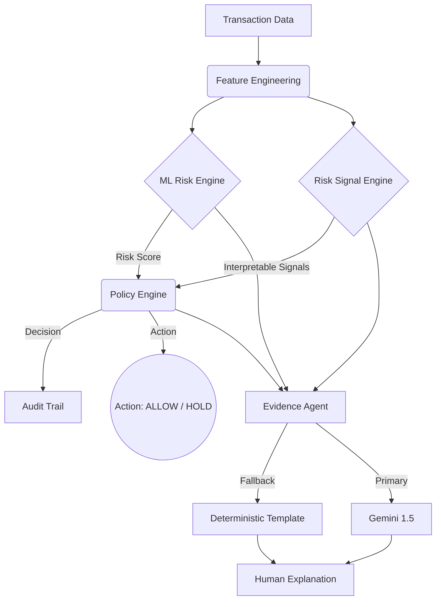

# RazorGuard — Explainable AI Transaction Risk Manager

> **Razorpay AI Buildathon 2026**
> Track 02 — AI Risk Manager submission

 *(Illustrative)*

## Overview
RazorGuard transforms a standard data-processing pipeline into a **production-quality AI Risk Manager**. It prevents merchants from losing money to fraud and chargebacks through an explainable, defense-only architecture that combines deterministic risk signals, ML models, and bounded LLM-powered evidence generation.

**Key features:**
* **True ML Risk Engine:** Uses a HistGradientBoosting model trained on a custom synthetic dataset.
* **Deterministic Policy Engine:** Strict "Defense-Only" action mapping (ALLOW, MONITOR, REVIEW, HOLD). The LLM cannot override this.
* **Interpretable Risk Signals:** 8 distinct anomaly detectors evaluating velocity, location, device, and behavioral profiles.
* **Bounded Evidence Agent:** Uses Google Gemini 1.5 to generate human-readable explanations from signals, falling back to a deterministic template if unavailable.
* **Business Cost Model:** Provides an honest, configurable evaluation of False Positive (review cost) vs False Negative (missed fraud) economics.
* **Interactive Dashboard:** Real-time view of risk distribution, model precision, and the review queue.

---

## The Buildathon Differentiator
Most AI applications stop at "predict fraud." RazorGuard goes further by answering:
1. **Why was it flagged?** (Interpretable signals + Evidence Agent)
2. **What should we do?** (Policy Engine)
3. **What does it cost the merchant?** (Cost Model)

Read the [MODEL_CARD.md](docs/MODEL_CARD.md) for detailed evaluation metrics (PR-AUC 0.95+) and the [SECURITY.md](docs/SECURITY.md) to see how we enforce defense-only constraints.

---

## Getting Started

### 1. Prerequisites
- Python 3.10+
- PostgreSQL & Redis (if running the full Celery/Docker stack)
- Optional: `GEMINI_API_KEY` in your `.env` file (the system falls back gracefully without it).

### 2. Setup
```bash
# Clone and setup environment
git checkout buildathon-track-02
python -m venv venv
.\venv\Scripts\activate
pip install -r requirements.txt
pip install scikit-learn==1.5.2 joblib matplotlib seaborn
```

### 3. Demo Mode (Easiest)
Run the automated demo script to start the API and launch the Dashboard:
```bash
# Windows
demo.bat
```

### 4. Rebuilding the ML Pipeline (Optional)
If you want to re-generate the dataset and retrain the models:
```bash
# 1. Generate 10k transaction dataset
python scripts/generate_dataset.py --num-transactions 10000

# 2. Train the models (Logistic Regression, Random Forest, HistGradientBoosting)
python ml/train.py

# 3. Run the held-out evaluation
python ml/evaluate.py
```
*Evaluation results will be saved to `evaluation/evaluation_report.md`.*

---

## API Endpoints

The system exposes a rich REST API (Swagger available at `/docs` when running):

* `POST /risk/analyze` - Analyze a single transaction
* `GET /risk/{txn_id}` - Get risk result
* `GET /risk/{txn_id}/explanation` - Get LLM/Deterministic explanation
* `POST /risk/batch` - Batch analysis
* `GET /risk/evaluation/metrics` - Fetch latest ML model evaluation
* `GET /risk/metrics/summary` - Aggregate system metrics

---

## Architecture



## Testing
The repository maintains 100% of the original unit tests, plus extensive new coverage for the risk components.
```bash
python -m pytest tests/ -v
```
