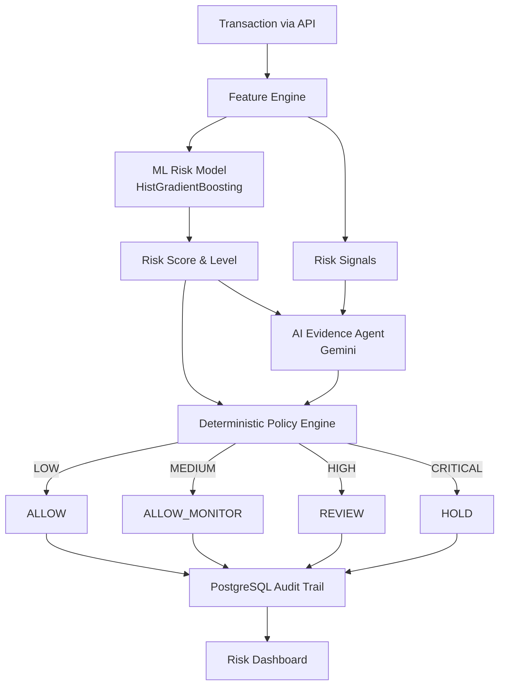

# Architecture

RiskPulse is a complete AI-powered transaction risk manager designed around deterministic defense constraints and persistent audit trails.

## End-to-End Flow

## Component Breakdown

1. **Feature Engine**: Computes high-value behavioral and velocity features based on a time-aware historical window (no target leakage).
2. **ML Risk Model**: A pre-trained `HistGradientBoostingClassifier` optimized for Precision-Recall AUC to handle extreme class imbalances inherent in fraud detection.
3. **AI Evidence Agent**: A large language model (Gemini) that converts raw feature deviations and risk signals into a human-readable explanation for manual review. *Crucially, the LLM cannot make financial decisions.*
4. **Deterministic Policy Engine**: Enforces strict, hard-coded bounding boxes on actions. A transaction with a `CRITICAL` risk score is mapped strictly to `HOLD`, regardless of the AI Evidence Agent's explanation.
5. **PostgreSQL Audit**: Every risk decision is logged persistently via SQLAlchemy/Alembic, ensuring compliance and historical review capability.
